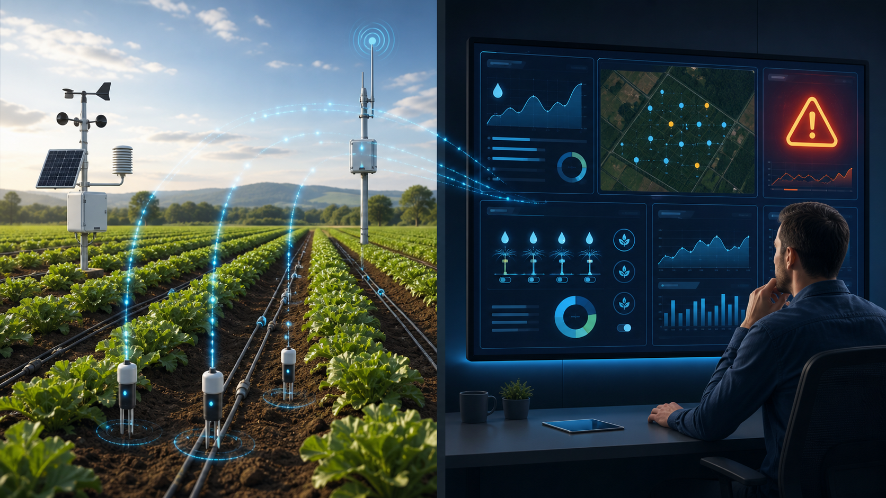

# Grupo 8 — Middleware para Microsserviços

Projeto prático de Sistemas Distribuídos. A solução simula monitoramento de sensores IoT em uma **Agricultura Inteligente**.

*Monitoramento de sensores no campo e central de resposta a alertas.*

## Integrantes

- Wilson Ramos
- Marcos Aurélio Ribeiro do Amaral
- Lucas Silva Irineu
- William Félix
- Murilo Henrique
- Ralph dos Reis Torres

## Arquitetura e requisitos atendidos

| Requisito | Implementação |
| --- | --- |
| Cliente → middleware → servidor → banco | Cliente → API Gateway → serviços → SQLite individual |
| Middleware do grupo | API Gateway com autenticação, roteamento, correlação e logs |
| Autenticação | `X-API-Key` externo e `X-Internal-API-Key` interno |
| Logs e timestamp | Logs estruturados no Gateway; timestamps UTC nas telemetrias e alertas |
| Exceções, timeout e fallback | HTTP 503/504 com `Retry-After`, timeout configurável e fila persistente para alertas pendentes |
| Sensor offline | Cada telemetria funciona como heartbeat; ausência de leitura gera alerta crítico configurável |
| Documentação da API | Swagger/OpenAPI automático em `/docs` |
| Testes funcionais | `pytest` cobre autenticação, persistência e ciclo de alerta |

Consulte [o guia de execução](docs/como-rodar.md), [a arquitetura](docs/arquitetura.md), [o relatório](docs/relatorio.md), [a proposta AWS](docs/proposta-aws.md) e [o roteiro de demonstração](docs/roteiro-demo.md).

## Execução com Docker

1. Copie `.env.example` para `.env` e, se necessário, altere as chaves.
2. Execute `docker compose up --build`.
3. Acesse `http://localhost:8000/docs`.

Use `docker compose down` para encerrar. Use `docker compose down -v` para remover também os dados de demonstração.

## Execução local

Requer Python 3.12 ou superior. Crie o ambiente, instale dependências e execute cada linha em um terminal próprio:

    python -m venv .venv
    .venv\Scripts\activate
    pip install -r requirements.txt
    uvicorn alerts.main:app --port 8002 --reload
    uvicorn telemetry.main:app --port 8001 --reload
    uvicorn gateway.main:app --port 8000 --reload

## Demonstração rápida (PowerShell)

    $headers = @{ "X-API-Key" = "grupo8-demo-key" }
    $body = @{ sensor_id="solo-talhao-01"; metric="soil_moisture"; value=18; unit="%"; location="Talhão Norte" } | ConvertTo-Json
    Invoke-RestMethod -Method Post -Uri http://localhost:8000/api/v1/telemetry -Headers $headers -ContentType "application/json" -Body $body
    Invoke-RestMethod -Uri http://localhost:8000/api/v1/alerts -Headers $headers

O segundo comando deve retornar um alerta `warning`, indicando baixa umidade do solo e necessidade de irrigação. Temperatura igual ou superior a `40 °C` também gera alerta `critical`.

## Endpoints públicos

Exceto por `/health`, todos exigem o cabeçalho `X-API-Key`.

| Método | Rota | Descrição |
| --- | --- | --- |
| GET | `/health` | Saúde do Gateway |
| POST | `/api/v1/telemetry` | Registra leitura e avalia alerta |
| GET | `/api/v1/telemetry?limit=50` | Lista leituras recentes |
| GET | `/api/v1/alerts?only_open=true` | Lista alertas abertos |
| PATCH | `/api/v1/alerts/{id}/acknowledge` | Reconhece um alerta |

Payload de exemplo:

    {"sensor_id":"solo-talhao-01","metric":"soil_moisture","value":18,"unit":"%","location":"Talhão Norte"}

## Testes

    pytest -q

## Estrutura

- `gateway/`: API Gateway (middleware)
- `telemetry/`: recebimento e persistência das leituras
- `alerts/`: regras, criação e reconhecimento de alertas
- `common/`: configurações, segurança e acesso SQLite
- `tests/`: testes funcionais
- `docs/`: arquitetura, relatório, proposta AWS e roteiro
