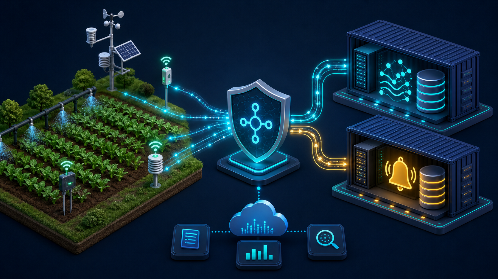
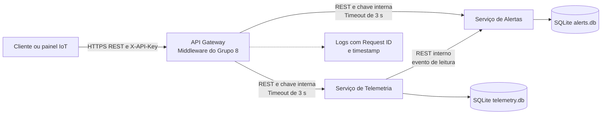

# Arquitetura da Solução

## Cenário

O cenário escolhido é uma **Agricultura Inteligente**. Sensores distribuídos pelos talhões reportam umidade do solo, temperatura, umidade do ar e fumaça. A central de monitoramento recebe as leituras, identifica risco de estresse hídrico, calor excessivo ou incêndio e permite que um operador reconheça os alertas.

*Representação visual da mediação feita pelo API Gateway entre dispositivos IoT agrícolas e os microsserviços.*

## Visão lógica

## Responsabilidades

| Componente | Responsabilidade |
| --- | --- |
| Cliente | Envia leituras e consulta alertas pela API pública. |
| API Gateway | Ponto único de entrada: autentica API Key, registra logs/correlação, roteia e traduz falhas. |
| Serviço de Telemetria | Valida e persiste medições, depois solicita avaliação das regras. |
| Serviço de Alertas | Aplica regras de negócio, persiste alertas e registra reconhecimento. |
| SQLite | Banco separado por serviço, evitando acoplamento direto entre bancos. |

## Fluxo principal

1. O cliente faz `POST /api/v1/telemetry` com `X-API-Key`.
2. O Gateway valida a chave, cria/propaga `X-Request-ID`, registra a requisição e encaminha à Telemetria.
3. A telemetria é persistida com timestamp UTC.
4. Telemetria chama internamente Alertas, que aplica as regras e grava um alerta quando necessário.
5. O operador consulta ou reconhece alertas também por meio do Gateway.

## Regras implementadas

| Métrica | Condição | Severidade |
| --- | --- | --- |
| `temperature` | ≥ 35 °C e < 40 °C | warning |
| `temperature` | ≥ 40 °C | critical |
| `humidity` | ≤ 25% | warning |
| `soil_moisture` | ≤ 20% | warning |
| `smoke` | > 0 | critical |

## Falhas, segurança e observabilidade

- Chamadas Gateway → serviço usam timeout configurável (`SERVICE_TIMEOUT_SECONDS`, padrão de 3 segundos).
- Timeout retorna HTTP 504; indisponibilidade retorna HTTP 503. Ambos orientam o cliente a tentar novamente em 5 segundos por meio do cabeçalho `Retry-After`.
- A leitura é salva antes da avaliação do alerta. Caso Alertas falhe, o evento é gravado em uma fila persistente (`pending_alert_evaluations`) e devolve `pending_due_to_alert_service_failure`.
- O Serviço de Telemetria tenta reprocessar pendências a cada 30 segundos e também antes de aceitar uma nova leitura. O endpoint interno `/maintenance/retry-pending` permite acionar a retentativa manual; `/pending-alerts` expõe o total pendente para operação.
- A chave única `telemetry_id` no Serviço de Alertas evita criar alertas duplicados caso uma retentativa alcance um evento já processado.
- O Gateway registra método, rota, status, duração e `X-Request-ID`.
- Chaves externa e interna são diferentes, impedindo o acesso do cliente às rotas privadas.

## Decisões e limitações

- REST/JSON foi escolhido por simplicidade, interoperabilidade e documentação automática no Swagger.
- SQLite reduz o custo da demonstração local; uma implantação real usaria banco gerenciado por serviço.
- A avaliação é síncrona nesta prova de conceito. A evolução recomendada é eventos em SQS/SNS ou EventBridge, com retentativas e DLQ.
- API Key atende à atividade; produção exigiria HTTPS, rotação de segredos, WAF e identidade centralizada.
