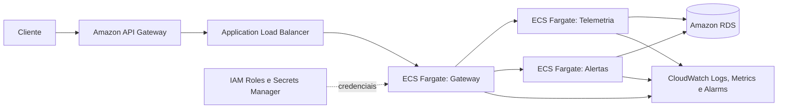

# Proposta de Integração com AWS
**ECS/EKS + API Gateway + CloudWatch + IAM**.

| Componente atual | Serviço AWS proposto | Papel |
| --- | --- | --- |
| Exposição da API | Amazon API Gateway | TLS, throttling, API keys/authorizer e rota pública. |
| Contêineres Docker | Amazon ECS com Fargate (ou EKS) | Execução e escala independente dos três serviços. |
| SQLite | Amazon RDS PostgreSQL, isolado por serviço | Persistência gerenciada e backups. |
| Logs locais | Amazon CloudWatch Logs | Centralização, retenção e busca por Request ID. |
| Alertas operacionais | CloudWatch Alarms + SNS | Aviso sobre erros, latência e indisponibilidade. |
| Segredos | Secrets Manager + IAM Roles | Chaves fora da imagem e acesso por mínimo privilégio. |

## Evolução assíncrona

Em produção, Telemetria publicaria `TelemetryReceived` em EventBridge ou SNS. Alertas consumiria por SQS, usando DLQ e retentativas. Isso elimina o acoplamento temporal da chamada REST síncrona usada na prova de conceito.

